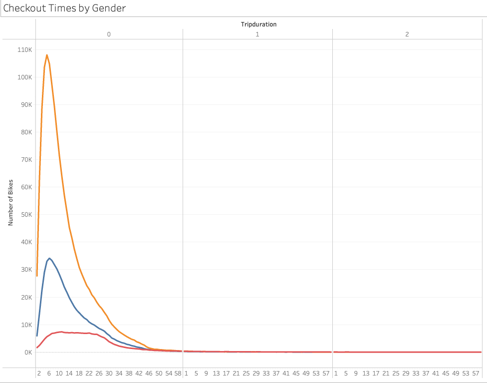
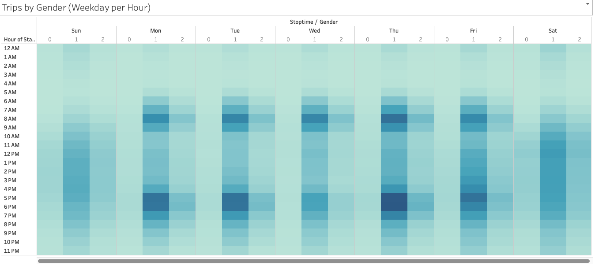
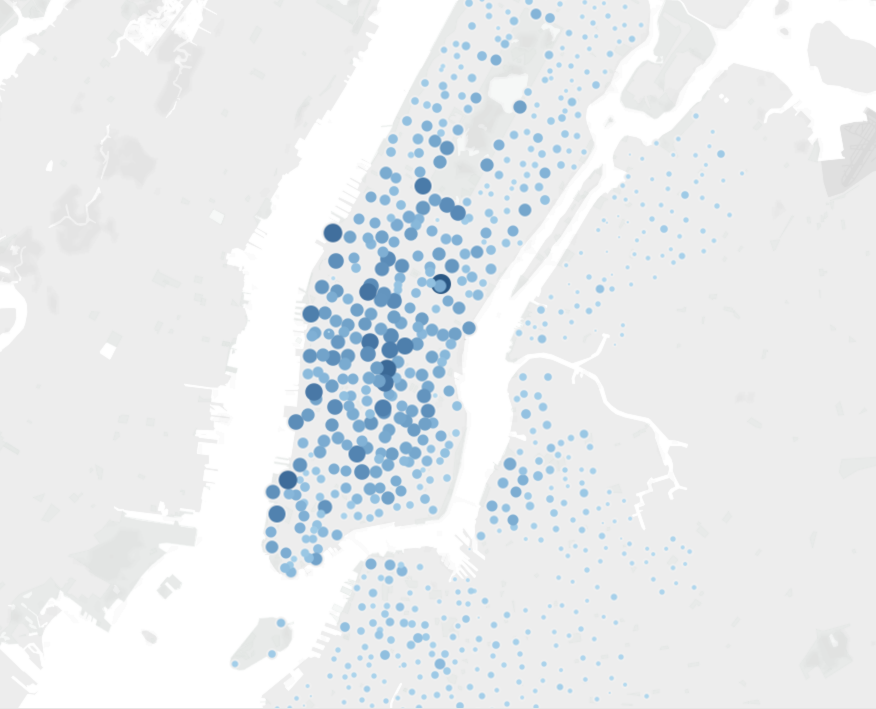
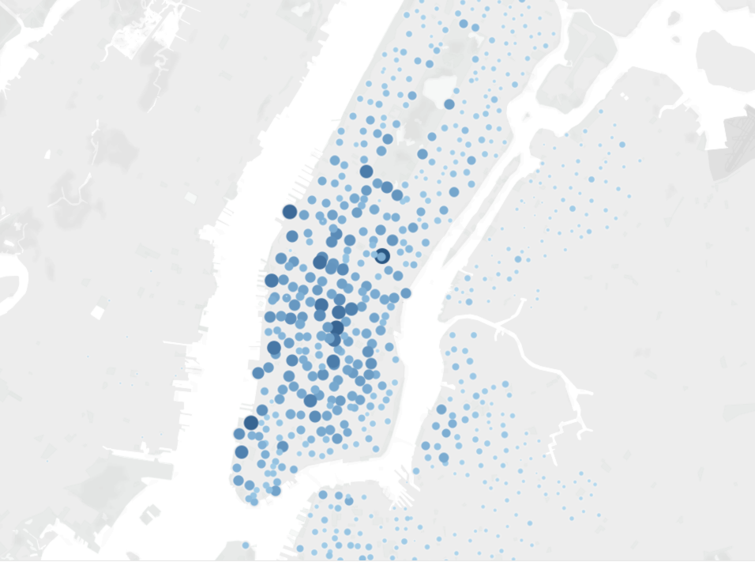
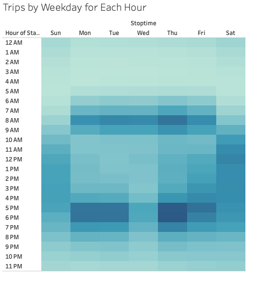

# New York City Citi Bike Analysis

## Purpose

The purpose of the project was to use data from New York City's Citi Bike program and see if it would be possible to recreate the program in De Moines, Iowa.
In order to complete this analysis, I used Python's pandas library to clean up the data and then created visualizations of that data using Tableau. 

## Results

Throughout this analysis I wanted to answer the following questions:

1. How long do users bike for?
2. Who is using the bikes?
3. Where are they biking to and from?
4. When are users using the bikes?

To answer these questions I came up with the following visualizations with Tableau.

### How long do users bike for?

The following image shows the duration of time for every bike ride during the month of August, 2019. Most rides were between 2-15 minutes.

### Who is using the bikes?

This shows the breakdown of riders by gender and the duration of times bikes were used. This also shows that men used the bikes more that women.

This shows that the most common user is a male subscriber and
their most frequent day of the week to ride on is Thursday.

### Where are they biking to and from?

The next two images show the the top starting and ending locations. The first thing to note is that most rides start in the most populous areas in mid and lower Manhattan. Second, due to shorter ride times, the ending locations are also in those same populous areas.

### When are users using the bikes?

Weekday riders peak traffic times match with traditional commuting times, while weekends see gradual use throughout the day.

To further these findings, this visualization shows a similar patterns when broken down between genders.

## Summary

Based on the findings above, these are the top takeaways to create a successful Citi Bike program in De Moines.

1. Advertising should target men as they are the primary users.
2. Bikes should be available in the most populous areas of the city.
3. Try to partner with large companies have them offer their employees and incentive for using the Citi Bike program for commuting.

For a more in depth and interactive view of this analysis, checkout the Tableau link below

[link to dashboard](https://public.tableau.com/app/profile/jade3140/viz/NYCCitiBikeAnalysis_16344897559410/NYCCitiBikeAnalysis?publish=yes)

